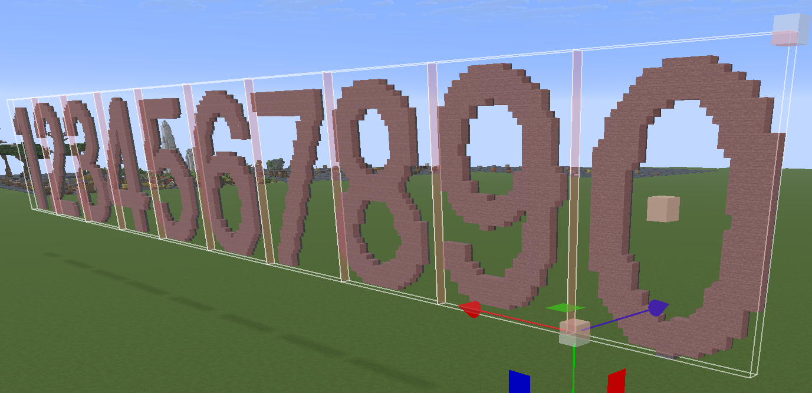
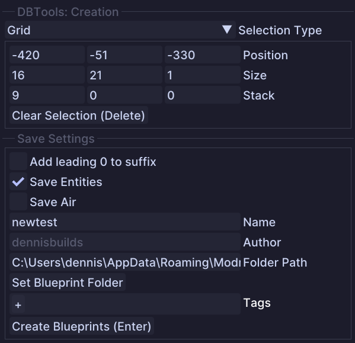
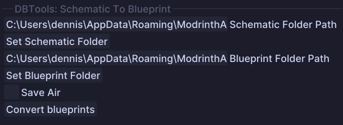

# DBTools - A mod for Axiom by denni5x

## Features:

DBTools is a mod for Axiom that provides various tools to enhance the development experience. It includes the following features:
- **Place Tool**: A tool to place blueprints in you world and auto rotating them according to the targeted block face.
- **Create Tool**: A tool to create multiple blueprints of assets which are aligned in a grid pattern.
- **Blueprint To Schematic Tool**: A tool to bulk convert blueprints into schematics.
- **Schematic To Blueprint Tool**: A tool to bulk convert schematics into blueprints.

## Installation:

1. Download the latest mod release
   The latest release can be found at https://github.com/denni5x/DBToolsDist/releases. 
   - If you don't know which version to download, check the version of Axiom you are using
     - You can find the version of Axiom in the `mods` folder of your Minecraft installation
   - The mod version should match the Axiom version and Minecraft version `DBTools-<Axiom Version>_<Minecraft Version>`
2. Locate your Minecraft Folder 
   - Windows: Hit Windows Key + R and type in %appdata%. Open the .minecraft folder
   - ac: On the bar at the top of your screen in Finder, click Go, then click Go to Folder and type ~/Library/Application Support/Minecraft, then press enter. 
   - Linux: .minecraft is located in your home folder. ~/.minecraft
3. Once in the Minecraft folder open the mods folder and paste the mod .jar file in it
   - If you do not have a mods folder, create one
5. Your folder should look something like this (probably with different versions):
   ```
   .minecraft
   ├── mods
   │   └── DBTools-4.9.1_1.21.4.jar
   │   └── Axiom-4.9.1-for-MC1.21.4.jar
   │   └── fabric-api-0.119.3+1.21.4.jar
   └── ...
   ```
   
## Check if the mod is loaded
- Open the Axiom Editor and have a look at Tools tab
- If you see the new icons at the end of the tools list you have successfully installed the mod
- You can hove over the icons to the see the tool names
- It should look like this:  


## Place Tool

### Usage
- In order to use the Place Tool, you need to load a blueprint make a selection and copy to the clipboard
- Once you have a blueprint in the clipboard, you can use the Place Tool to place it in your world
- The Place Tool will automatically rotate the blueprint according to the targeted block face

- In the following example I copied a selection (in this case it is a simple window pattern)  

- Now you can adjust the settings  


### Tool Options
  - `Live Preview`: If enabled, the preview will be updated in real-time as you move your mouse
  - `Include Non-Solid Blocks`: If enabled, the tool will respect non-solid blocks while placing (helpful for placing on grass blocks, so it ignores grass/ tall grass/ fern etc.)
  - `Position Offset`: This is only for display purposes, it does not affect the placement of the blueprint
  - `Paste Settings`: Same as Axiom paste settings
  - `Ctrl + F`: Flips the clipboard
  - `Ctrl + R`: Rotates the clipboard
  - `Ctrl + V`: Paste the clipboard at the current mouse position
  - `Use Tool`: Also pastes the clipboard at the current mouse position
  - `Mousewheel Up/ Down`: Moves the preview in the direction of the mouse cursor

## Create Tool

### Usage
- The Create Tool allows you to create multiple blueprints of assets which are aligned in a grid pattern
- Its basically a combination of Axiom functionalities: Box Select, Copy & Save Blueprint  

- Once the tool is selected you can draw your selection in the world
- Either use the mouse wheel to stack the selection in a direction left/ right/ up/ down or the tool options  

- When all settings are set, you press `Enter` to create the blueprints in the selected folder

### Tool Options
- `Position/ Size/ Stack`: These are the settings for the selection box. Use the mouse wheel to adjust the values or type in the values manually
- `Clear Selection`: Clears the current selection
- `Save Air`: If enabled, the tool will save air blocks
- `Save Entities`: If enabled, the tool will save entities
  - Entity saving can take a while, depending on the amount of entities in the selection
- `Name`: The name of the blueprint to be created. For every blueprint a simple suffix will be counted up
- `Author`: The author of the blueprint, this will be your username by default
- `Folder Path`: The folder where the blueprints will be saved. You can use the button to set a folder
- `Tags`: Tags for the blueprint, you can add multiple tags, like in Axiom
- `Create Blueprints`: This button will create the blueprints and save them in the selected folder

## Blueprint To Schematic Tool

### Usage
- The Blueprint To Schematic Tool allows you to bulk convert blueprints into schematics
- Simply select the source folder and the target folder for the blueprints and schematics respectively
- Notice: the created schematics will have the new `.schem` file extension
- Once selected press the `Convert` button to start the conversion process  


### Tool Options
- `Blueprint Folder Path`: The folder where the blueprints are located
- `Schematic Folder Path`: The folder where the schematics are located
- `Convert Blueprints`: This button will convert all blueprints in the selected folder to schematics and save them in the target folder

## Schematic To Blueprint Tool

### Usage
- The Schematic To Blueprint Tool allows you to bulk convert schematics into blueprints
- Simply select the source folder and the target folder for the blueprints and schematics respectively
- Notice: The tool will convert schematics with the `.schem`, `.schematic` and `.litematic` file extension
- Once selected press the `Convert` button to start the conversion process  


### Tool Options
- `Schematic Folder Path`: The folder where the schematics are located
- `Blueprint Folder Path`: The folder where the blueprints are located
- `Convert Blueprints`: This button will convert all schematics in the selected folder to blueprints and save them in the target folder

## Theme and Layout

If you want my theme and or layout, you can copy the following code snippets and paste them into your Axiom Editor.
You can find the layout settings in the Axiom Editor under `Window -> Load Layout from Clipboard` and the theme 
settings under `Help -> Style Editor -> Import from Clipboard`.
<details>
<summary>Expand For Theme and Layout</summary>

### Catppuccin Mocha Blue Theme:

```
ASel0AEENhdHBwdWNjaW5fTW9jaGEJSW1HdWlEYXJrKQD/9NbNAf9wW1gC8C4eHgTwLh4eBf8bEREHZkQyMQhmRDIxCWZEMjEK/y4eHgv/RDIxDIJEMjEN/y4eHg6CGxERD/9wW1gQ/1pHRRH/RDIxEv/+vrQT//6+tBT/spmTFWZEMjEW/3BbWBf/spmTGH4uHh4ZzIZwbBr/hnBsG4BwW1gc//6+tB3//r60HjP6tIkfq/q0iSD/+rSJIf9EMjEigf6+tCOB/r60JP9EMjElgf6+tCb//r60J/+GcGwt/5yEfy7/hnBsMv+v4vkFBUCAAAAGQIAAAAdAgAAACECAAAALQUAAAA==
```

### Axiom Layout:

```
[Window][###Tools]
Pos=796,1909
Size=2511,115
Collapsed=0
DockId=0x00000004,0

[Window][###Tool Options]
Pos=0,30
Size=794,1994
Collapsed=0
DockId=0x00000001,1

[Window][###Clipboard]
Pos=3309,30
Size=531,396
Collapsed=0
DockId=0x0000000D,0

[Window][###TargetInfo]
Pos=3309,30
Size=531,396
Collapsed=0
DockId=0x0000000D,1

[Window][###Palette]
Pos=3309,428
Size=531,396
Collapsed=0
DockId=0x0000000E,0

[Window][###ActiveBlock]
Pos=3309,826
Size=531,199
Collapsed=0
DockId=0x0000000C,0

[Window][###History]
Pos=3309,1027
Size=531,597
Collapsed=0
DockId=0x0000000A,0

[Window][###WorldProperties]
Pos=3309,1626
Size=531,398
Collapsed=0
DockId=0x00000008,0

[Window][DockSpaceViewport_11111111]
Pos=0,30
Size=3840,1994
Collapsed=0

[Window][###Inventory]
Pos=3309,428
Size=531,396
Collapsed=0
DockId=0x0000000E,1

[Window][Debug##Default]
Pos=60,60
Size=400,400
Collapsed=0

[Window][###OpenBlueprint]
Pos=0,30
Size=794,1994
Collapsed=0
DockId=0x00000001,0

[Window][###StyleEditor]
Pos=1310,414
Size=1832,1259
Collapsed=0

[Table][0x26A1A81F,2]
Column 0  Weight=1.0354
Column 1  Weight=0.9646

[Docking][Data]
DockSpace           ID=0x8B93E3BD Window=0xA787BDB4 Pos=0,30 Size=3840,1994 Split=X
DockNode          ID=0x00000005 Parent=0x8B93E3BD SizeRef=3307,1000 Split=X
DockNode        ID=0x00000001 Parent=0x00000005 SizeRef=794,1000 Selected=0xE8563286
DockNode        ID=0x00000002 Parent=0x00000005 SizeRef=2511,1000 Split=Y Selected=0x1F1A625A
DockNode      ID=0x00000003 Parent=0x00000002 SizeRef=1239,1877 CentralNode=1 NoTabBar=1 Selected=0x1F1A625A
DockNode      ID=0x00000004 Parent=0x00000002 SizeRef=1239,115 Selected=0x80AFE82B
DockNode          ID=0x00000006 Parent=0x8B93E3BD SizeRef=531,1000 Split=Y Selected=0x34064FA7
DockNode        ID=0x00000007 Parent=0x00000006 SizeRef=300,800 Split=Y Selected=0x34064FA7
DockNode      ID=0x00000009 Parent=0x00000007 SizeRef=300,500 Split=Y Selected=0x34064FA7
DockNode    ID=0x0000000B Parent=0x00000009 SizeRef=300,400 Split=Y Selected=0x34064FA7
DockNode  ID=0x0000000D Parent=0x0000000B SizeRef=300,200 Selected=0x444DCCF9
DockNode  ID=0x0000000E Parent=0x0000000B SizeRef=300,200 Selected=0x1E514AEA
DockNode    ID=0x0000000C Parent=0x00000009 SizeRef=300,100 Selected=0x1D216E21
DockNode      ID=0x0000000A Parent=0x00000007 SizeRef=300,300 Selected=0xFE0E9DDF
DockNode        ID=0x00000008 Parent=0x00000006 SizeRef=300,200 Selected=0x602D8B84

[AxiomWindows]
tools
tool_options
palette
inventory
active_block
history
world_properties
clipboard
target_info
blueprint_browser
```

</details>