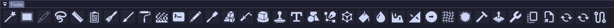

# Download/ Installation

## Download

Latest version can be found here: [https://github.com/denni5x/DBToolsDist/releases](https://github.com/denni5x/DBToolsDist/releases)

## Installation

1. Download the latest mod release The latest release can be found at https://github.com/denni5x/DBToolsDist/releases.
   * If you don't know which version to download, check the version of Axiom you are using
     * You can find the version of Axiom in the `mods` folder of your Minecraft installation
   * The mod version should match the Axiom version and Minecraft version `DBTools-<Axiom Version>_<Minecraft Version>`
2. Locate your Minecraft Folder
   * Windows: Hit Windows Key + R and type in %appdata%. Open the .minecraft folder
   * ac: On the bar at the top of your screen in Finder, click Go, then click Go to Folder and type \~/Library/Application Support/Minecraft, then press enter.
   * Linux: .minecraft is located in your home folder. \~/.minecraft
3. Once in the Minecraft folder open the mods folder and paste the mod .jar file in it
   * If you do not have a mods folder, create one
4.  Your folder should look something like this (probably with different versions):

    ```
    .minecraft
    ├── mods
    │   └── DBTools-4.9.1_1.21.4.jar
    │   └── Axiom-4.9.1-for-MC1.21.4.jar
    │   └── fabric-api-0.119.3+1.21.4.jar
    └── ...
    ```

## Check if the mod is loaded

* Open the Axiom Editor and have a look at Tools tab
* If you see the new icons at the end of the tools list you have successfully installed the mod
* You can hove over the icons to the see the tool names
* It should look like this:

<div align="center"></div>
