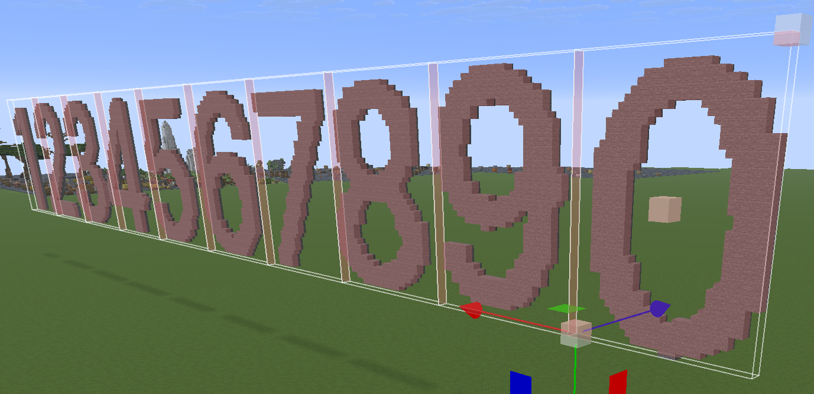
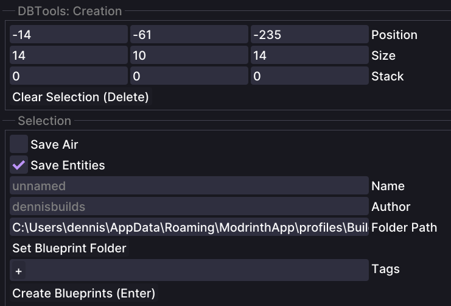
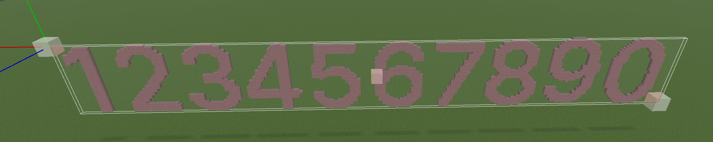
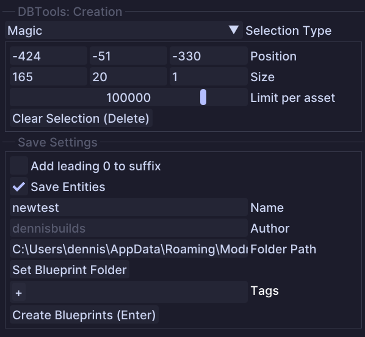

# Blueprint Create

## Usage

* The Create Tool allows you to create multiple blueprints of assets
* It's basically a combination of Axiom functionalities: Box Select or Magic Select, Copy & Save Blueprint
* Grid selection works as follows:
  * You select a box use the mouse wheel to stack the selection in a direction left/ right/ up/ down or the `Stack` settings

* Magic selection works as follows:
* You select only one box for all assets and the tool use Magic Select to all connected blocks
* The mouse wheel will adjust the size of the selection box, like in the Box Select Tool of Axiom
* Be aware that the Magic Select will select all connected blocks, your assets should not be connected to other blocks, otherwise the tool will select them as well (even outside the selected box)

* When all settings are done, you press `Enter` to create the blueprints in the selected folder
* If a blueprint name already exist in the target folder, the tool will automatically search for the highest suffix and continue counting from there

## Tool Options

* `Selection Type`: There are two selection types available:
  * `Grid`: This is the default selection type, it allows you to select a box in the world
  * `Magic`: This selection type allows you to select blocks in a more flexible way, similar to the Magic Select tool in Axiom
* `Position/ Size/ Stack`: These are the settings for the selection box. Use the mouse wheel to adjust the values or type in the values manually
* `Clear Selection`: Clears the current selection
* `Save Air`: If enabled, the tool will save air blocks
  * This is only during Grid selection available, it will not save air blocks in Magic selection
* `Add leading 0 to suffix`: If enabled, the tool will add a leading 0 to the suffix of the blueprints
  * You basically set the amount of digits for the suffix, so it will look like this: `blueprint_0001.bp`, `blueprint_0002.bp`, etc.
* `Save Entities`: If enabled, the tool will save entities
  * Entity saving can take a while, depending on the amount of entities in the selection
* `Name`: The name of the blueprint to be created. For every blueprint a simple suffix will be counted up
* `Author`: The author of the blueprint, this will be your username by default
* `Folder Path`: The folder where the blueprints will be saved. You can use the button to set a folder
* `Tags`: Tags for the blueprint, you can add multiple tags, like in Axiom
* `Create Blueprints`: This button will create the blueprints and save them in the selected folder
