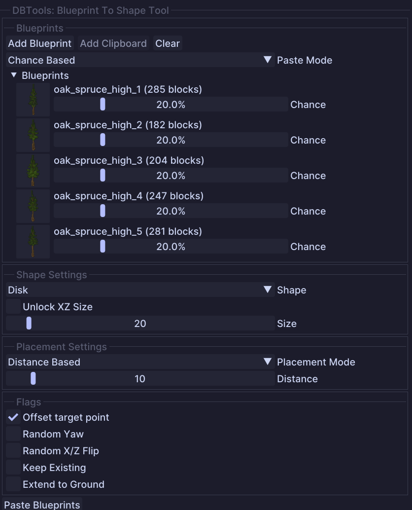

# Blueprint To Shape

Place blueprints along geometric shapes like circles, rectangles, polygons, superellipses, and spirals.

## Usage

* **Right-click** on a block to set the origin point of the shape
* The shape preview will appear centered on the origin
* Blueprints will be distributed along the shape's edge based on your placement settings
* Press **Enter** to paste the blueprints or use the "Paste Blueprints" button
* Press **Escape** or **Delete** to cancel

## Tool Options

### Blueprints Section

* `Add Blueprint`: Opens the blueprint browser to add a blueprint
* `Add Clipboard`: Adds the current clipboard selection (only available when clipboard is not empty)
* `Clear`: Removes all added blueprints
* `Paste Mode`: Only appears when multiple blueprints are added
  * **Chance Based**: Randomly selects blueprints based on their chance percentage
  * **Alternating**: Cycles through blueprints in order

### Shape Settings

* `Shape`: The geometric shape to place blueprints along
  * **Circle/Disk**: Standard ellipse shape
  * **Rectangle/Plane**: Four-sided rectangle with corners
  * **Regular Polygon**: Polygon with configurable number of sides (3-12)
  * **Superellipse**: A shape between an ellipse and a rectangle, controlled by an exponent
  * **Spiral**: Archimedean spiral from center outward
* `Unlock XZ Size`: When enabled, allows setting different X and Z dimensions
* `Size` / `Size X` / `Size Z`: The dimensions of the shape (1-256 blocks)
* `Sides` (Regular Polygon only): Number of sides for the polygon (3-12)
* `Exponent` (Superellipse only): Controls the shape curvature (0.5-20.0)
  * Lower values (< 2): More diamond/star-like
  * Value of 2: Standard ellipse
  * Higher values (> 2): More rectangular
* `Loops` (Spiral only): Number of rotations in the spiral (0.5-10.0)

### Placement Settings

* `Placement Mode`: How blueprints are distributed along the shape
  * **Distance Based**: Places blueprints at fixed intervals
  * **Count Based**: Places an exact number of blueprints evenly distributed
  * **Corners + Edges** (Rectangle/Polygon only): Prioritizes corners, then fills edges
* `Distance` (Distance Based): Spacing between blueprint placements (1-100 blocks)
* `Blueprint Count` (Count Based / Corners + Edges): Total number of blueprints to place (1-128)
* `Place on Corners` (Corners + Edges): When enabled, always places blueprints on corner points

### Flags

* `Offset When Placing`: When enabled, places on the block face you click rather than inside the block
* `Random Yaw`: Randomly rotates each blueprint (0, 90, 180, or 270 degrees)
* `Random XZ Flip`: Randomly flips blueprints on X and/or Z axis
* `Keep Existing`: Preserves existing blocks; new blocks only fill air
* `Extend To Ground`: Extends the bottom layer of each blueprint down to the ground

## Tips


The origin point (shown as a yellow box) is the center of your shape. All size values extend outward from this point.



Use **Corners + Edges** mode with **Place on Corners** enabled to ensure decorations always appear at corner points of rectangles and polygons.



For fence posts or pillars around a building, use Rectangle shape with Count Based placement to get evenly spaced results.

