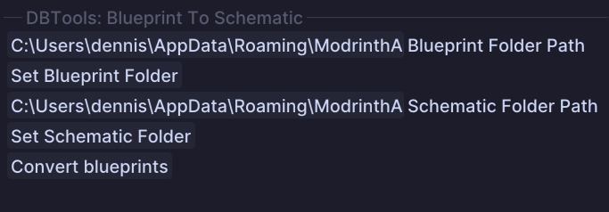

# Bulk Blueprint To Schematic

## Usage

* The Blueprint To Schematic Tool allows you to bulk convert blueprints into schematics
* Simply select the source folder and the target folder for the blueprints and schematics respectively
* Notice: the created schematics will have the new `.schem` file extension
* Once selected press the `Convert` button to start the conversion process

## Tool Options

* `Blueprint Folder Path`: The folder where the blueprints are located
* `Schematic Folder Path`: The folder where the schematics are located
* `Convert Blueprints`: This button will convert all blueprints in the selected folder to schematics and save them in the target folder
