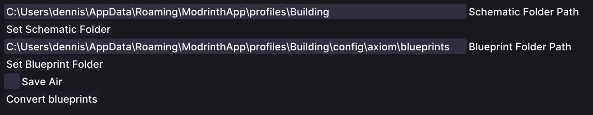

# Bulk Schematic To Blueprint

## Usage

* The Schematic To Blueprint Tool allows you to bulk convert schematics into blueprints
* Simply select the source folder and the target folder for the blueprints and schematics respectively
* Notice: The tool will convert schematics with the `.schem`, `.schematic` and `.litematic` file extension
* Once selected press the `Convert` button to start the conversion process

## Tool Options

* `Schematic Folder Path`: The folder where the schematics are located
* `Blueprint Folder Path`: The folder where the blueprints are located
* `Convert Blueprints`: This button will convert all schematics in the selected folder to blueprints and save them in the target folder

