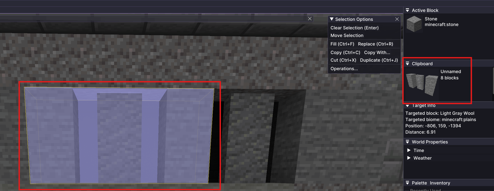

# Clipboard/ Blueprint Place

## Usage

* In order to use the Place Tool, you need to load a blueprint make a selection and copy to the clipboard
* Once you have a blueprint in the clipboard, you can use the Place Tool to place it in your world
* The Place Tool will automatically rotate the blueprint according to the targeted block face
* In the following example I copied a selection (in this case it is a simple window pattern)

* Now you can adjust the settings

<figure><figcaption></figcaption></figure>

## Tool Options

* `Live Preview`: If enabled, the preview will be updated in real-time as you move your mouse
* `Auto Rotate`: Enable automatic rotation for the clipboard according to the target block face
* `Include Non-Solid Blocks`: If enabled, the tool will respect non-solid blocks while placing (helpful for placing on grass blocks, so it ignores grass/ tall grass/ fern etc.)
* `Position Offset`: This is only for display purposes, it does not affect the placement of the blueprint
* `Paste Settings`: Same as Axiom paste settings
* `Ctrl + F`: Flips the clipboard
* `Ctrl + R`: Rotates the clipboard - useful when clipboard is oriented wrong for `Auto Rotate`
* `Ctrl + V`: Paste the clipboard at the current mouse position
* `Use Tool`: Also pastes the clipboard at the current mouse position
* `Mousewheel Up/ Down`: Moves the preview in the direction of the mouse cursor




