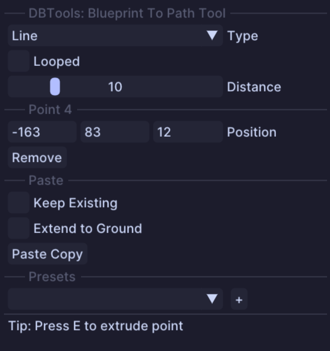

# Clipboard/ Blueprint To Path

## Usage

* This tool is similar to the existing Path Tool with the clipboard option
* A few differences are there:
  * This tool does not rotate the clipboard
  * Instead of pasting the clipboard right next to each other this tool allows for separation of the clipboards
  * A new parameter `Distance` is introduced that lets you separate each pasted clipboard along the path
  * The extend to ground option only extends the last layer of the clipboard to the ground, like the Stamp Tool does
* This tool works great if you want to paste the same clipboard along a path (like lanterns along a small path)

## Tool Options

* `Type`: Same options can be found for the Path Tool of Axiom - only difference being the first to line types are now just 'Line' as there isnt a big difference for this tool
* `Looped`: Connects last point with the first point
* `Distance`: Distance between each insertion point of a clipboard
  * Note: This is not the distance between each clipboard, the insertion point of a clipboard is pretty much central of X/Z
* `Point Section`: View some info of the current selected point
* `Keep Existing`: Keeps existing blocks while pasting the clipboards
* `Extend To Ground`: Extends the last layer of each clipboard to the ground
* `Paste Copy`: Button to paste the current clipboard path - can also use `Enter` to paste


