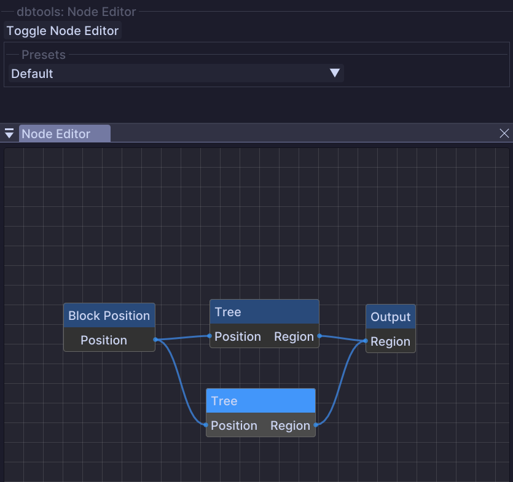

# Node Editor (WIP)


This tool is currently a Work In Progress. Features and parameters may change.


A visual node-based graph system for creating complex procedural generation workflows.

## Overview

The Node Editor provides a visual programming interface where you can connect different nodes to create custom generation logic. Each node performs a specific operation, and data flows through connections between nodes.

<figure><figcaption></figcaption></figure>

## Usage

* Open the Node Editor window from the tool options
* **Left-click** to select nodes
* **Drag** to move nodes around the canvas
* Connect node outputs to inputs by dragging between ports
* Configure selected node options in the tool panel

## Features

* Visual graph-based workflow
* Multiple node types for different operations
* Real-time preview of results
* Save and load node graphs

<!--
## Node Types

TODO: Document available node types

## Tool Options

TODO: Add screenshots and document parameters

-->


Join the Discord for updates on this tool's development and to provide feedback.

