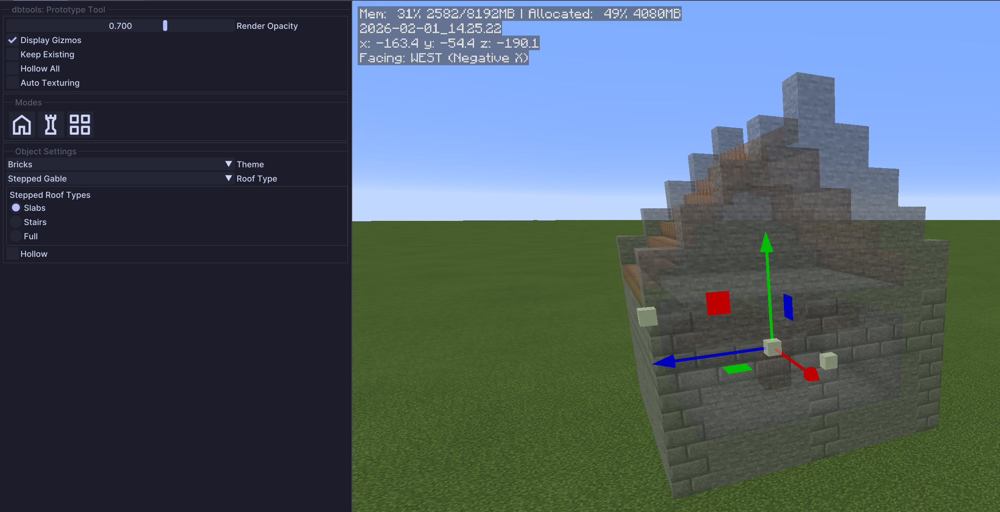

# Prototype Tool

Generate procedural structures like houses, towers, and bridges with customizable themes and auto-texturing.

## Overview

The Prototype Tool allows you to quickly generate and preview procedural buildings and structures. You can place pre-defined object types or use custom build assets, with real-time preview and theme customization.

## Usage

* Select an object type from the dropdown (House, Tower, Bridge, or Build Asset)
* Position and configure the structure using gizmos
* Adjust theme and texturing settings
* Press **Enter** to place the structure

## Object Types

### House

Generates a procedural house structure with configurable dimensions.

### Tower

Generates a vertical tower structure.

### Bridge

Generates a bridge structure spanning between points.

### Build Asset

Place saved build assets with transformation controls:
* Position offset (X, Y, Z)
* Rotation (0, 90, 180, 270 degrees)
* User-defined rotation
* Flip on X and Z axes
* Auto-rotate to surface normal

## Tool Options

### General Settings

<figure><figcaption></figcaption></figure>

* `Opacity`: Preview render opacity (0-1)
* `Display Gizmos`: Show/hide manipulation gizmos
* `Keep Existing`: Preserve existing blocks when placing
* `Hollow Region`: Generate hollow interiors

### Theme Settings

Select from multiple pre-defined color and material themes to customize the appearance of generated structures.

### Auto Texturing

* `Auto Texturing`: Enable noise-based roof and surface variations
* `Noise Type`: Type of noise pattern to use (e.g., Voronoi)
* `Block Replacement`: Configure which blocks get replaced with variations
* `Thresholds`: Control the noise cutoff for block replacement

### Asset Settings (Build Asset mode)

* `Asset Offset` (X, Y, Z): Position offset from placement point
* `Asset Rotation`: 90-degree rotation increments (0-3)
* `User Rotation`: Fine rotation control
* `Flip X / Flip Z`: Mirror the asset on X or Z axis
* `Auto Rotate`: Automatically rotate asset to match surface orientation
* `Live Preview`: Enable real-time preview while adjusting settings
* `Offset When Placing`: Place on the block face rather than inside the block

## Tips


Use **Auto Texturing** to add natural variation to roofs and walls, making structures look more organic and less repetitive.



**Hollow Region** is useful when you want to generate just the shell of a building and fill the interior yourself.


